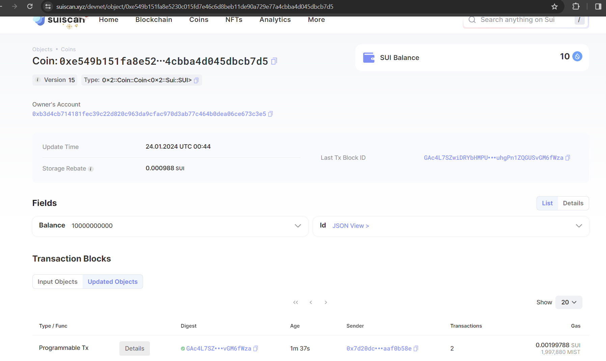
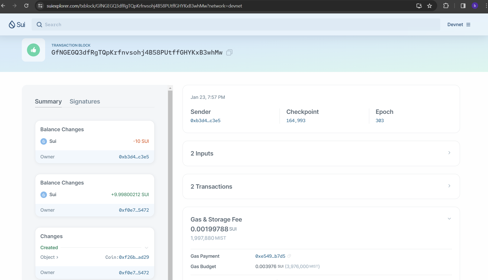
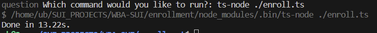

**All TESTNET**
**Note Secure for Learning Only, Never expose PK**

# keygen:

    You've generated a new Sui wallet: 0xb3d4cb714181fec39c22d820c963da9cfac970d3ab77c464b0dea06ce673c3e5

    To save your wallet, copy and paste the following into a JSON file:

    [205,135,82,122,92,191,230,26,186,193,84,37,231,224,134,137,88,91,210,10,145,131,234,192,175,104,252,61,220,0,124,86]

    You can use the below HEX to import the key into a web wallet:

    cd87527a5cbfe61abac15425e7e08689585bd20a9183eac0af68fc3ddc007c56

# airdrop:

    Success! Check out your TX here:
            https://suiscan.xyz/devnet/object/0xe549b151fa8e5230c015fd7e46c6d8beb11de90a729e77a4cbba4d045dbcb7d5

# transfer:

    Success! Check our your TX here:
        https://suiexplorer.com/txblock/GfNGEGQ3dfRgTQpKrfnvsohj4B58PUtffGHYKxB3whMw?network=devnet
    Oops, something went wrong: Error: Failed to sign transaction by a quorum of validators because of locked objects. Retried a conflicting transaction Some(TransactionDigest(GfNGEGQ3dfRgTQpKrfnvsohj4B58PUtffGHYKxB3whMw)), success: Some(true)

# enrolled success:

